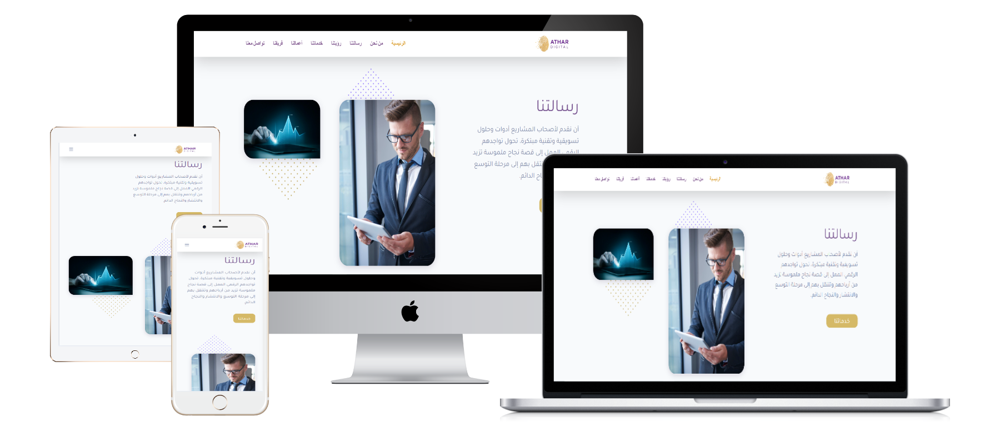
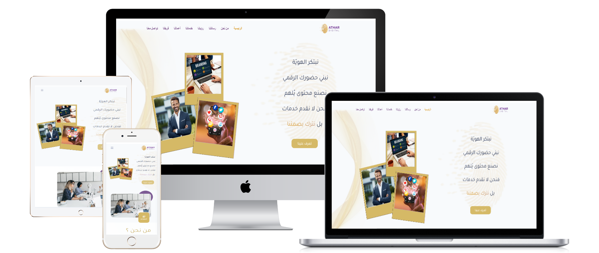
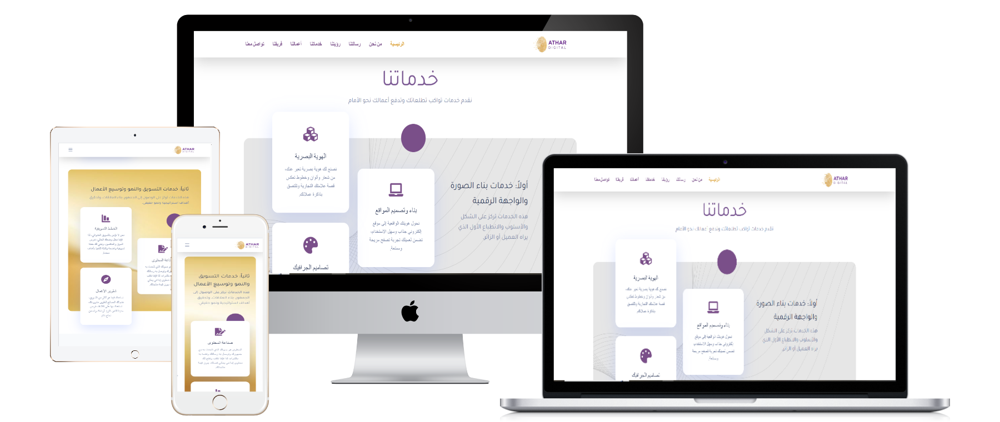
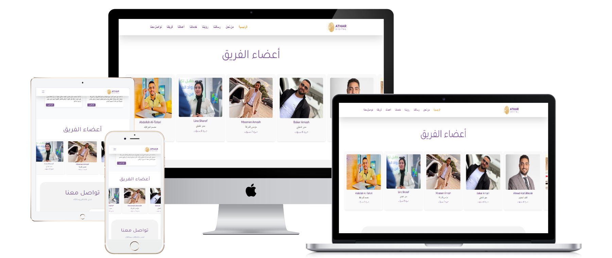

# Athar-Digital-Digital-Solutions-Web-Development
Corporate website showcasing Athar Digital's services, past projects, contact information, and team.
## pictures

## 📝 الوصف القصير للمشروع
- العميل: Athar Digital  – شركة متخصصة في تقديم حلول رقمية متكاملة تشمل تصميم وتطوير المواقع الإلكترونية، التسويق الرقمي، وتحسين محركات البحث (SEO).
- نوع الموقع: موقع مؤسسي يعرض خدمات الشركة، مشاريعها السابقة، معلومات الاتصال، وفريق العمل.
- الهدف من التصميم: إنشاء موقع احترافي يعكس هوية الشركة ويقدم خدماتها بشكل جذاب وسهل الاستخدام، مع التركيز على تجربة المستخدم والأداء التقني.
- التقنيات المستخدمة: WordPress | Elementor | HTML | CSS | JavaScript | SEO | تصميم متجاوب (Responsive Design)

## 💡 المميزات والتفاصيل الإضافية
- عرض الخدمات بوضوح: تنظيم واضح للخدمات المقدمة مثل تصميم وتطوير المواقع، التسويق الرقمي، وتحسين محركات البحث.
- عرض المشاريع السابقة: عرض لأمثلة من الأعمال السابقة التي قامت بها الشركة لتعزيز مصداقيتها.
- معلومات الاتصال وفريق العمل: توفير معلومات مفصلة عن طرق التواصل مع الشركة وفريق العمل.
- تصميم متجاوب: توفير تجربة مستخدم متميزة على مختلف الأجهزة.

## 🔗 رابط الموقع: https://athardigitalpro.com/

  
